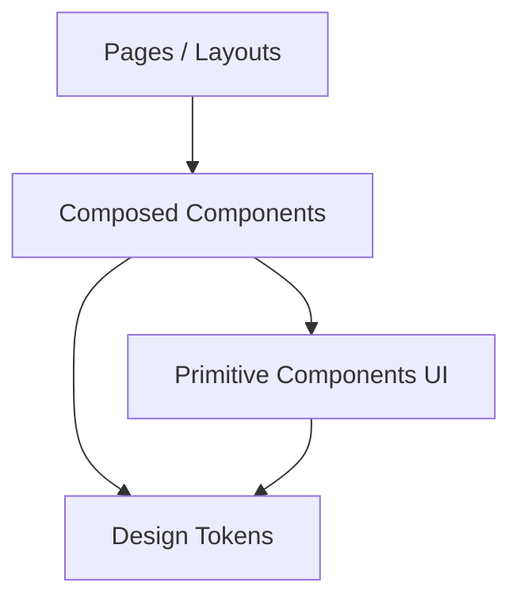
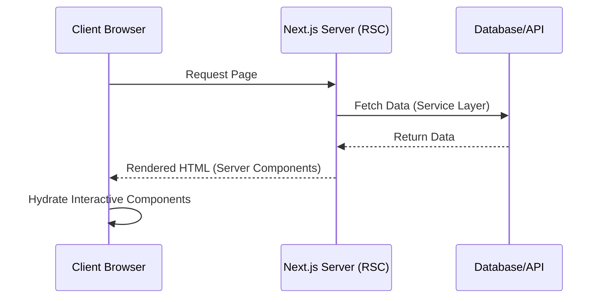

# Architecture

This document describes the architectural philosophy and conventions of the Next.js Master Starter Template.

## Overview and Philosophy

The template is designed around **scalability, predictability, and separation of concerns**. It heavily leverages the React Server Components paradigm while maintaining a strict boundary between UI presentation and business logic.

## Directory Structure

```text
src/
├── app/               # Routing, Pages, Layouts (Server Components by default)
├── components/        # Presentational UI
│   ├── ui/            # Base primitives (Buttons, Inputs)
│   ├── layout/        # Page layouts (Containers, Shells)
│   ├── navigation/    # Menus, Sidebars
│   ├── feedback/      # Alerts, Loading states, Empty states
│   └── data-display/  # Tables, Cards, Timelines
├── config/            # Static configuration files
├── design-system/     # Design tokens and theme configs
├── features/          # Feature-based domains (optional, for scaling)
├── hooks/             # Shared client-side logic
├── lib/               # Utilities, integrations, and services
└── types/             # Shared TypeScript definitions
```

## App Router Conventions

- Use `layout.tsx` for shared UI shells.
- Use `page.tsx` for route-specific content.
- Use `loading.tsx` and `error.tsx` for progressive rendering and graceful degradation.

## Server vs Client Component Strategy

- **Server Components (Default):** Used for data fetching, SEO-critical content, and static UI.
- **Client Components (`"use client"`):** Used exclusively for interactivity (state, effects, event listeners). Pushed down the component tree as far as possible.

## Component Hierarchy



## Data Flow Patterns



## Config-Driven Approach

Menus, metadata, and site configurations are stored in `src/config/` to decouple configuration from implementation, allowing non-developers to update basic app settings easily.
