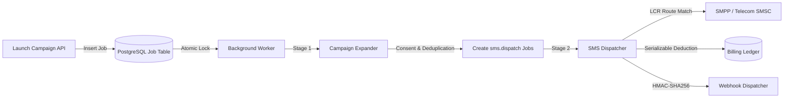

# Architecture & Engineering Standards — Range Bulk SMS

> For the comprehensive, end-to-end technical specification, multi-tenant hierarchy, signaling protocols, and queue engine, refer to the master [SYSTEM_ARCHITECTURE_AND_SPECIFICATION.md](./SYSTEM_ARCHITECTURE_AND_SPECIFICATION.md).

---

## 1. Overview & Philosophy

**Range Bulk SMS** is an enterprise-grade bulk messaging and mobile infrastructure platform engineered by **Range View Technology Services Uganda Limited**. It is designed around **high availability, multi-tenant security, predictable billing ledger serializability, and low-latency telecom routing**.

The platform leverages the **Next.js 16 App Router** with **React 19 Server Components (RSC)**, **Prisma ORM 7** with PostgreSQL, **Tailwind CSS 4**, and native protocol drivers (SMPP v3.4 and hardware edge gateways).

---

## 2. Directory Architecture

```text
src/
├── app/                           # Next.js App Router (145+ pages and API routes)
│   ├── (auth)/                    # Authentication route group (Login, Register, 2FA, Passkeys)
│   ├── (dashboard)/               # Authenticated dashboard (SMS, Contacts, Wallet, Developer, etc.)
│   ├── api/                       # Internal API endpoints (Campaigns, Cron, Contacts, Wallet)
│   ├── api/v1/                    # Public Developer REST API (Messages, Balance, Gateways)
│   ├── globals.css                # Master CSS variables, design tokens & Tailwind 4 setup
│   └── layout.tsx                 # Root layout with theme and session providers
├── components/                    # Modular React UI components
│   ├── ui/                        # Base primitives (Radix UI, CVA, Buttons, Inputs, Dialogs)
│   ├── layout/                    # Shells and navigation (RangeShell, RangeSidebar, Header)
│   ├── sms/                       # Messaging components (NetworkBadge, CharacterCounter)
│   ├── chat/                      # Customer support chat widget (SupportChatbox)
│   └── docs/                      # Code snippets and OpenAPI documentation components
├── config/                        # Static and dynamic configurations
│   ├── navigation.ts              # Hierarchical sidebar navigation definition
│   └── site.ts                    # Platform metadata and branding
├── design-system/                 # Design token system
│   └── tokens/                    # Color palettes, typography scales, spacing grids
├── lib/                           # Core business logic, services, and engines
│   ├── auth/                      # NextAuth and Bearer API key authentication
│   ├── billing/                   # Double-entry ledger and serializable credit deductions
│   ├── contacts/                  # Dynamic segment AST compiler and CSV importer
│   ├── queue/                     # Database-backed background worker with atomic locking
│   │   ├── worker.ts              # Polling daemon with retry and backoff
│   │   └── handlers/              # CampaignExpander, SmsDispatcher, WebhookDispatcher
│   ├── security/                  # Rate limiting, AIT fraud prevention, CSRF filters
│   ├── sms/                       # Normalizer, Least Cost Routing, Consent service
│   │   └── providers/             # Native SMPP v3.4 driver & Mock adapter
│   ├── prisma.ts                  # Cached Prisma Client singleton with PG adapter
│   └── utils.ts                   # Tailwind cn() utility
├── proxy.ts                       # Edge proxy middleware (Asset routing & CSRF protection)
└── types/                         # Shared TypeScript domain types and interfaces
```

---

## 3. Server vs Client Component Boundary Strategy

To maximize performance, reduce client JavaScript bundle size, and optimize Time to Interactive (TTI):

1. **Server Components by Default**:
   - All page layouts (`layout.tsx`), marketing pages, static documentation, and initial data loaders run exclusively on the server.
   - Database queries via Prisma occur directly on the server without intermediary REST overhead.
2. **Client Components (`"use client"`)**:
   - Pushed down to the furthest leaf nodes where client-side interactivity, DOM listeners, or React state are strictly required.
   - Examples: Form inputs (`react-hook-form`), interactive tables (`@tanstack/react-table`), modals (`@radix-ui/react-dialog`), and charts (`recharts`).

---

## 4. Asynchronous Queue & Messaging Pipeline

Message campaigns are decoupled from web request lifecycles through a two-stage background queue:



---

## 5. Security & Isolation Directives

- **Serializable Billing Ledger**: All wallet deductions and refund transactions enforce `Prisma.TransactionIsolationLevel.Serializable` to guarantee mathematical integrity across concurrent worker nodes.
- **Strict Compliance & Consent**: Every recipient is checked against an append-only `ConsentLog`. Unsubscribed or suppressed numbers are filtered prior to dispatch.
- **Anti-Fraud & Velocity Guards**: Detects Artificially Inflated Traffic (AIT) and toll fraud attempts, pausing affected campaigns automatically.
- **Edge CSRF & Session Protection**: Origin validation in `src/proxy.ts` prevents cross-site request forgery and enforces authenticated session boundaries.

---

*For complete implementation details, see [SYSTEM_ARCHITECTURE_AND_SPECIFICATION.md](./SYSTEM_ARCHITECTURE_AND_SPECIFICATION.md).*
