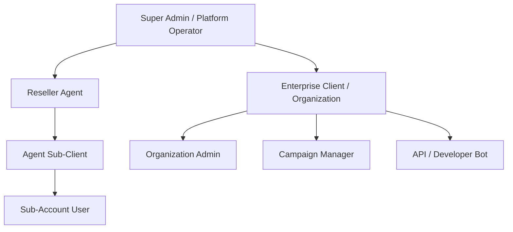
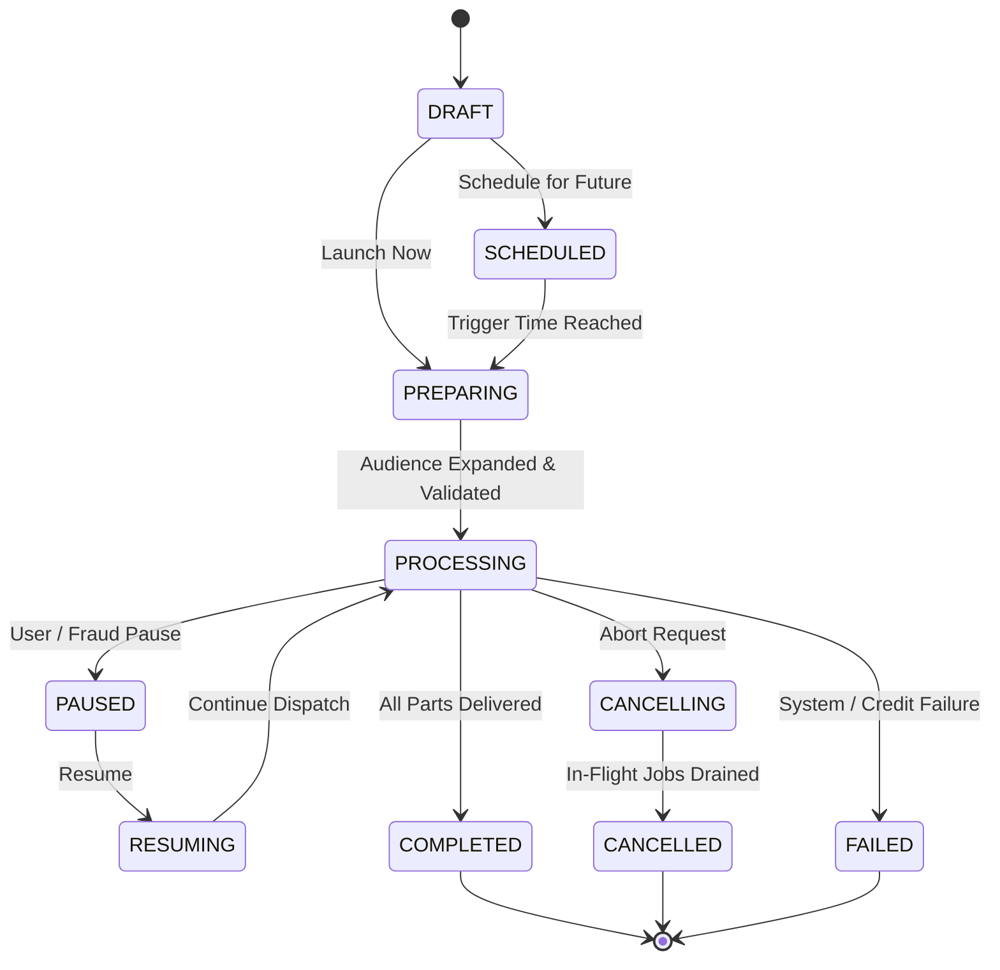
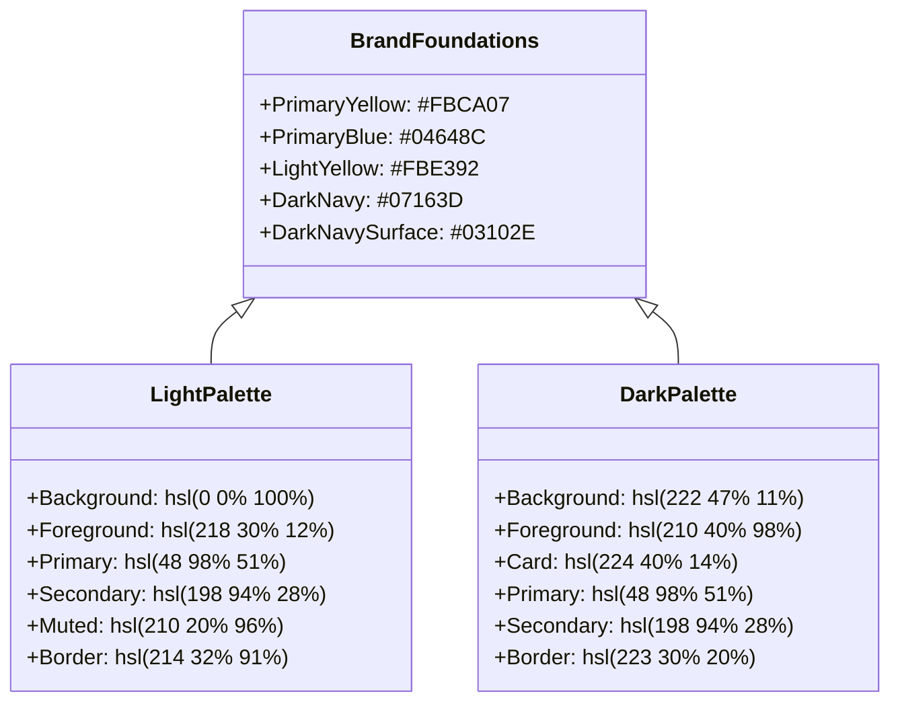
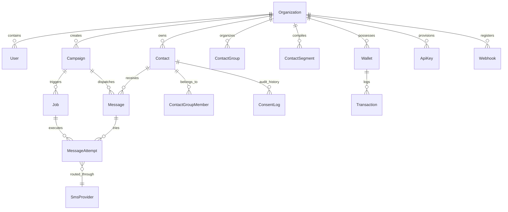
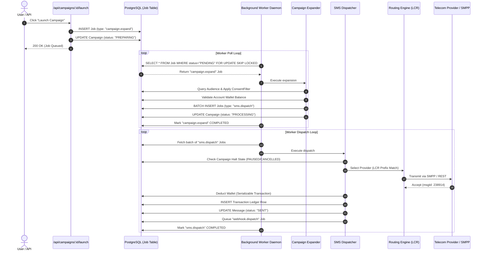

# Range Bulk SMS — Comprehensive System Architecture & Engineering Specification

> **Platform**: Range Bulk SMS  
> **Entity**: Range View Technology Services Uganda Limited  
> **Version**: 1.0.0 (Enterprise Carrier-Grade Release)  
> **Framework**: Next.js 16.3.5 (Turbopack) • React 19 • TypeScript 5 • Prisma ORM 7 • Tailwind CSS 4  

---

## Table of Contents

1. [Executive Summary & Platform Identity](#1-executive-summary--platform-identity)
2. [Multi-Tenant Hierarchy & Access Control (RBAC)](#2-multi-tenant-hierarchy--access-control-rbac)
3. [End-to-End System Architecture](#3-end-to-end-system-architecture)
4. [Core Business Functionalities & Workflows](#4-core-business-functionalities--workflows)
   - [4.1 SMS & Messaging Suite](#41-sms--messaging-suite)
   - [4.2 Advanced Campaign Engine (Broadcast, Recurring, Drip)](#42-advanced-campaign-engine-broadcast-recurring-drip)
   - [4.3 Contact Management & Dynamic Segment AST Compiler](#43-contact-management--dynamic-segment-ast-compiler)
   - [4.4 Consent, Opt-In/Opt-Out & Suppression List Compliance](#44-consent-opt-inopt-out--suppression-list-compliance)
   - [4.5 Carrier Least Cost Routing (LCR) & Failover Engine](#45-carrier-least-cost-routing-lcr--failover-engine)
   - [4.6 Native SMPP v3.4 Telecom Protocol Driver](#46-native-smpp-v34-telecom-protocol-driver)
   - [4.7 Hardware & IoT SMS Gateways (Android & ESP32 SIM800L)](#47-hardware--iot-sms-gateways-android--esp32-sim800l)
   - [4.8 Billing, Wallet & Double-Entry Transaction Ledger](#48-billing-wallet--double-entry-transaction-ledger)
   - [4.9 Reseller & Agent Commission Engine](#49-reseller--agent-commission-engine)
   - [4.10 Security, Anti-Fraud & Distributed Rate Limiting](#410-security-anti-fraud--distributed-rate-limiting)
   - [4.11 Developer Platform, Public API (v1) & Webhook Subsystems](#411-developer-platform-public-api-v1--webhook-subsystems)
   - [4.12 Telemetry, Delivery Receipts (DLR) & Analytics](#412-telemetry-delivery-receipts-dlr--analytics)
   - [4.13 Customer Support & Real-Time Chat Assistant](#413-customer-support--real-time-chat-assistant)
5. [Directory Structure & Module Breakdown](#5-directory-structure--module-breakdown)
6. [Technology Stack & Dependency Inventory](#6-technology-stack--dependency-inventory)
7. [UI/UX Design System, Color Tokens & Aesthetic Specifications](#7-uiux-design-system-color-tokens--aesthetic-specifications)
   - [7.1 Brand Foundations & Semantic Theme Palettes](#71-brand-foundations--semantic-theme-palettes)
   - [7.2 Telecom Network Brand Identities](#72-telecom-network-brand-identities)
   - [7.3 Developer Portal & HTTP Method Tokenization](#73-developer-portal--http-method-tokenization)
   - [7.4 Typography, Spacing & Elevation Grid](#74-typography-spacing--elevation-grid)
   - [7.5 Component Patterns & Accessibility (a11y) Standards](#75-component-patterns--accessibility-a11y-standards)
8. [Data Models & Database Schema Overview](#8-data-models--database-schema-overview)
9. [Background Processing & Queue Execution Pipeline](#9-background-processing--queue-execution-pipeline)
10. [Quality Assurance, Testing & Build Verification](#10-quality-assurance-testing--build-verification)

---

## 1. Executive Summary & Platform Identity

**Range Bulk SMS** is a carrier-grade enterprise bulk messaging and mobile infrastructure platform built by **Range View Technology Services Uganda Limited**. It provides high-throughput, mission-critical SMS broadcast services, transactional messaging, two-factor authentication delivery, and hardware-coupled mobile gateway integration engineered specifically for East African telecom ecosystems (Uganda, Kenya, Tanzania, Rwanda) as well as global routing.

The platform unifies commercial bulk SMS campaigns, automated contact directory synchronization, compliance/suppression list enforcement, reseller agent commissions, prepaid billing ledgers, and low-level telecom signaling into a single, high-performance Next.js 16 full-stack architecture.

### Strategic Differentiators
- **Direct Telecom Interconnects**: Direct SMPP v3.4 signaling drivers to MTN Uganda and Airtel Uganda alongside HTTP/REST aggregators.
- **Hardware Gateway Bridging**: Support for native Android GSM gateways and remote ESP32 SIM800L microcontroller hardware modules.
- **Strict Compliance & Consent**: Regulatory compliance aligning with Uganda Communications Commission (UCC), GDPR, and TCPA guidelines via immutable, append-only consent tracking.
- **Financial Security**: Strict double-entry transactional accounting with serializable database transaction isolation to prevent double-spending or credit race conditions.
- **Reseller Multi-Tenancy**: Built-in tiered agent commissions, white-label client management, and real-time commission disbursements.

---

## 2. Multi-Tenant Hierarchy & Access Control (RBAC)

The platform enforces a five-level hierarchical tenant model governed by strict Role-Based Access Control:



### Roles & Permission Matrix
| Role | Scope | Capabilities |
|---|---|---|
| **ADMIN** | System-Wide | Full administrative override, provider routing management, system audit logs, global pricing config, agent commission payouts, sender ID approvals, job queue telemetry. |
| **AGENT** | Reseller Portal | Onboard client accounts, assign client credit pools, configure markup margins, track real-time commissions, request wallet withdrawals. |
| **CLIENT_ADMIN** | Organization | Full tenant management, wallet top-up, user invitations, API key generation, webhook configuration, sender ID requests. |
| **MANAGER** | Workspace | Create, launch, pause, and cancel campaigns, import contacts, manage custom variables and templates, view delivery reports. |
| **MEMBER / VIEWER** | Workspace | Read-only access to campaign telemetry, contact groups, and delivery logs. |

---

## 3. End-to-End System Architecture

The application is structured as a decoupled, layered enterprise architecture:

```mermaid
flowchart TB
    subgraph ClientLayer [Client & Ingestion Layer]
        Browser[Next.js 16 Web App]
        DevAPI[Public REST API v1]
        AndroidGW[Android GSM Gateway]
        ESP32[ESP32 SIM800L Gateways]
    end

    subgraph SecurityLayer [Security & Edge Layer]
        Proxy[Edge Proxy & CSRF Filter]
        RateLimit[Upstash Redis Sliding-Window Rate Limiter]
        FraudEngine[AIT Fraud & OTP Pumping Guard]
        AuthGuard[NextAuth & Bearer Token Validator]
    end

    subgraph CoreServices [Core Business Logic]
        CampaignMgr[Campaign Engine]
        SegmentComp[Dynamic Segment AST Compiler]
        ConsentSvc[Consent & Suppression Service]
        BillingSvc[Serializable Billing Ledger]
        RoutingEng[Least Cost Routing Engine]
    end

    subgraph QueueWorkers [Asynchronous Execution Pipeline]
        WorkerDaemon[Background Job Worker Daemon]
        Expander[Campaign Expansion Worker]
        Dispatcher[SMS Dispatch Worker]
        WebhookWorker[Webhook HMAC Dispatcher]
    end

    subgraph ProviderLayer [Signaling & Telecom Gateway]
        SMPPDriver[Native SMPP v3.4 Driver]
        HTTPProviders[Telecom REST APIs - MTN / Airtel]
        HardwareBridge[Device Gateway Poller]
    end

    ClientLayer --> SecurityLayer
    SecurityLayer --> CoreServices
    CoreServices --> QueueWorkers
    QueueWorkers --> ProviderLayer
    ProviderLayer --> SMSC[(Telecom SMSC Networks)]
```



---

## 4. Core Business Functionalities & Workflows

### 4.1 SMS & Messaging Suite
- **Single / Quick SMS**: Instant message dispatch to single or ad-hoc phone numbers with real-time GSM 03.38 character counter, unicode detection, message part calculation (160 chars GSM, 70 chars UCS-2), and credit cost preview.
- **Scheduled SMS**: Timezone-aware scheduling engine enabling broadcasts to be dispatched at future calendar dates with minute-level precision.
- **Custom SMS with Dynamic Variables**: Supports personalized bulk messaging using mustache-style dynamic merge tags (e.g., `Hello {{name}}, your account balance is UGX {{balance}}`). Values are resolved per contact during campaign expansion.
- **Sender ID Governance**: Dedicated alphanumeric sender ID application pipeline requiring corporate justification, sample message payload, and KYC verification before administrative approval.
- **Template Library**: Reusable message templates categorized by purpose (Transactional, Marketing, Notifications, Alerts) with instant dynamic variable substitution.

### 4.2 Advanced Campaign Engine (Broadcast, Recurring, Drip)
The platform features an enterprise campaign execution lifecycle with 20 deterministic states:



#### Campaign Types
1. **BROADCAST**: One-off instant or scheduled blast to designated contact groups or dynamic segments.
2. **RECURRING**: Automated recurring campaigns powered by 5-field CRON expressions or intervals (Daily, Weekly, Monthly) with an optional `maxOccurrences` ceiling. Upon cycle completion, the engine automatically calculates `nextRunAt` and schedules the next batch.
3. **DRIP**: Sequential automated messaging workflows that deliver scheduled touchpoints over multi-day or multi-week intervals based on contact sign-up or enrollment date.

### 4.3 Contact Management & Dynamic Segment AST Compiler
- **Phone Normalization**: Automated phone parser and sanitizer (`src/lib/sms/normalizer.ts`) converting inputs to standard E.164 format with deep East African prefix resolution (`+256` Uganda, `+254` Kenya, `+255` Tanzania, `+250` Rwanda).
- **Static Groups & Tags**: Many-to-many organizational structure mapping contacts across functional categories (e.g., VIP, Leads, Kampala Retail).
- **Dynamic Segment AST Compiler**: Abstract Syntax Tree compiler (`src/lib/contacts/segment-compiler.ts`) allowing dynamic audience generation using recursive `AND`/`OR` Boolean rule trees:
  - Supported Fields: `name`, `phone`, `email`, `carrier`, `status`, `createdAt`, `metadata.*`.
  - Supported Operators: `EQUALS`, `NOT_EQUALS`, `CONTAINS`, `NOT_CONTAINS`, `STARTS_WITH`, `ENDS_WITH`, `GREATER_THAN`, `LESS_THAN`, `IS_EMPTY`, `IS_NOT_EMPTY`.
  - Evaluates tens of thousands of contact records with zero runtime SQL injection vulnerability.

### 4.4 Consent, Opt-In/Opt-Out & Suppression List Compliance
Built specifically to satisfy statutory telecommunications privacy mandates:
- **Append-Only Consent Ledger**: Every consent modification is recorded permanently in the `ConsentLog` database table with timestamp, IP address, user agent, channel (`WEB`, `SMS`, `API`, `IMPORT`), and reason.
- **Opt-In / Opt-Out State Machine**: Contacts marked `OPT_OUT` or `SUPPRESSED` are automatically filtered out during campaign expansion.
- **Marketing vs. Transactional Exemptions**: System distinguishes between promotional marketing broadcasts (requiring active opt-in) and critical transactional notifications (OTPs, banking alerts, password resets) allowed under lawful basis exemptions.

### 4.5 Carrier Least Cost Routing (LCR) & Failover Engine
Located at `src/lib/sms/routing-engine.ts`:
- **Carrier Prefix Detection**: Instantly identifies destination network carrier:
  - **MTN Uganda**: `077`, `078`, `076`, `039`.
  - **Airtel Uganda**: `070`, `075`, `074`.
  - **Uganda Telecom (UTL)**: `071`.
  - **Safaricom Kenya**: `070`, `071`, `072`, `079`.
- **Dynamic Routing & Cost Optimization**: Queries active providers from `SmsProvider` database, sorts by lowest rate per SMS for the target carrier, and validates provider health scores.
- **Automatic Failover**: If the primary route returns an unrecoverable telecom failure (e.g., SMPP bind failure or network timeout), the engine shifts the message attempt to the secondary backup provider in real time.

### 4.6 Native SMPP v3.4 Telecom Protocol Driver
Located at `src/lib/sms/providers/smpp-provider.ts`:
- **Direct Signaling**: Eliminates third-party HTTP aggregators by opening native binary TCP sockets directly to mobile network operator Short Message Service Centers (SMSC).
- **Binary PDU Handling**: Implements full Protocol Data Unit (PDU) encoding and decoding:
  - `bind_transmitter` (`0x00000002`): Authenticates system with SMSC credentials, system type, and interface version `0x34`.
  - `submit_sm` (`0x00000004`): Dispatches short message with source/destination TON (Type of Number), NPI (Numbering Plan Identification), data coding, and ESM class.
  - `enquire_link` (`0x00000015`): Transmits periodic keep-alive heartbeat to maintain persistent telecom socket sessions.
  - `unbind` (`0x00000006`): Gracefully closes telecom sessions.
- **SMPP Sequence Management**: Thread-safe atomic counter guaranteeing synchronous correlation between command requests and SMSC `command_status` responses.

### 4.7 Hardware & IoT SMS Gateways (Android & ESP32 SIM800L)
Provides hybrid edge messaging capabilities when internet-to-SMSC links are unavailable or when utilizing low-cost local SIM cards:
- **Android GSM Gateway**: Mobile application pairs with the web platform via a secure cryptographic token. Polls `/api/v1/device/gateways/queue`, sends SMS via the device's native dual-SIM slots, and reports DLR results back to `/api/v1/device/gateways/messages/result`.
- **ESP32 + SIM800L Microcontroller Gateway**: Lightweight IoT firmware that maintains an HTTP/WebSocket connection to `/api/v1/gateways/pair`. Ideal for off-grid industrial telemetry, rural alerts, and autonomous micro-gateways.

### 4.8 Billing, Wallet & Double-Entry Transaction Ledger
Located at `src/lib/billing/billing-service.ts`:
- **Prepaid Credit Architecture**: Organizations maintain a prepaid credit balance (`smsCredits`) and fiat wallet (`balance`).
- **Serializable Isolation Guarantee**: All wallet operations run inside `Prisma.TransactionIsolationLevel.Serializable`. Concurrent dispatch jobs cannot overdraw an account under high concurrency.
- **Immutable Transaction Audit Ledger**: Deductions, refunds, and deposits record a corresponding immutable `Transaction` row referencing the originating `Message` or `Campaign` ID, preventing double-billing on retry loops.
- **Payment Ingestion**: Webhooks and payment processors for MTN Mobile Money, Airtel Money, and card rails.

### 4.9 Reseller & Agent Commission Engine
- **Commission Models**: Configurable percentage markup, fixed margin per SMS, or tiered volume thresholds.
- **Automatic Accrual**: As client organizations under an agent send messages, the system automatically calculates the margin and writes an `APPROVED` or `PENDING` commission row to the `Commission` ledger.
- **Payout Management**: Administrative tracking of agent withdrawal requests with ledger settlement.

### 4.10 Security, Anti-Fraud & Distributed Rate Limiting
- **Artificially Inflated Traffic (AIT) / OTP Pumping Guard** (`src/lib/security/fraud-prevention.ts`):
  - **Velocity Throttling**: Detects automated bots repeatedly requesting OTPs or sending messages to the exact same handset over short rolling time windows.
  - **Toll Fraud Blocking**: Hard-blocks high-cost premium-rate international ranges prone to SMS revenue sharing fraud schemes.
  - **Circuit Breaker**: Automatically halts and pauses running campaigns if anomaly detection triggers, preventing account balance depletion.
- **Distributed Rate Limiting** (`src/lib/security/rate-limiter.ts`):
  - Uses `@upstash/ratelimit` with Redis sliding-window algorithms for multi-region serverless deployments.
  - High-speed in-memory sliding window fallback when Redis credentials are not configured.
- **Authentication & Credential Protection**:
  - WebAuthn / Passkeys (`@simplewebauthn`) for biometric hardware-bound login.
  - Time-based One-Time Passwords (TOTP) and SMS OTP challenge verification.
  - Argon2 and Bcrypt password hashing.
  - Inactivity screen locking and CSRF origin verification in edge proxy (`src/proxy.ts`).

### 4.11 Developer Platform, Public API (v1) & Webhook Subsystems
- **Public REST API (`/api/v1/`)**:
  - `POST /api/v1/messages`: High-throughput single and bulk programmatic message dispatch.
  - `GET /api/v1/messages/:id`: Message status and delivery lookup.
  - `GET /api/v1/balance`: Real-time wallet and SMS credit queries.
  - `GET /api/v1/sender-ids`: Approved sender ID listing.
- **Cryptographic API Key Management**:
  - SHA-256 hashed storage of API tokens (`rk_live_...`).
  - Scoped permissions (`sms:send`, `contacts:read`, `reports:read`).
- **Real-Time Webhooks (`src/lib/queue/handlers/webhook-dispatcher.ts`)**:
  - Dispatches message lifecycle events (`message.sent`, `message.delivered`, `message.failed`, `campaign.completed`).
  - Cryptographically signed with `X-Range-Signature: sha256=...` generated via `HMAC-SHA256`.
  - Exponential backoff retry engine with delivery attempt logging in `WebhookDelivery`.
- **Interactive API Documentation**: Embedded Swagger UI at `/api/docs` generated via `next-swagger-doc` adhering to OpenAPI 3.0 standards.

### 4.12 Telemetry, Delivery Receipts (DLR) & Analytics
- **Handset Delivery Receipts**: Real-time webhook ingestion from telecom providers updating handset status (`DELIVERED`, `UNDELIVERED`, `EXPIRED`, `REJECTED`).
- **Visual Analytics**: Interactive Recharts components displaying message volume over time, carrier distribution donut charts, and failure reason breakdowns.
- **Export Engine**: Filterable, server-side CSV export for regulatory auditing and client reconciliation.

### 4.13 Customer Support & Real-Time Chat Assistant
- Floating client support chat box (`src/components/chat/support-chatbox.tsx`) accessible across the dashboard.
- Full ticket lifecycle management (`src/app/api/support/tickets`).

---

## 5. Directory Structure & Module Breakdown

```text
range-bulk-sms/
├── .github/
│   └── workflows/
│       └── ci.yml                     # Automated CI/CD pipeline (Lint, Typecheck, Test, Build)
├── prisma/
│   ├── schema.prisma                  # Master database schema with 45+ models & enums
│   └── seed.ts                        # Development database seeding script
├── src/
│   ├── app/                           # Next.js App Router (145+ compiled routes)
│   │   ├── (auth)/                    # Authentication Route Group
│   │   │   ├── login/                 # User credentials & WebAuthn passkey login
│   │   │   ├── register/              # Self-service client registration
│   │   │   ├── 2fa/                   # Two-factor authentication verification
│   │   │   ├── otp/                   # OTP challenge input
│   │   │   ├── screen-lock/           # Inactivity lock screen
│   │   │   ├── forgot-password/       # Password recovery request
│   │   │   └── reset-password/        # Token-verified password reset
│   │   ├── (dashboard)/               # Authenticated Dashboard Application
│   │   │   ├── dashboard/             # Main role-based metrics & agent overview
│   │   │   ├── sms/                   # SMS Messaging Subsystem
│   │   │   │   ├── send/              # Quick message composer
│   │   │   │   ├── scheduled/         # Scheduled queue management
│   │   │   │   ├── custom/            # Dynamic variable message builder
│   │   │   │   ├── campaigns/         # Campaign list, builder, and live telemetry
│   │   │   │   ├── templates/         # Template CRUD management
│   │   │   │   ├── variables/         # Custom merge tags registry
│   │   │   │   └── delivery-reports/  # Handset DLR log table & filters
│   │   │   ├── contacts/              # Contact & Audience Management
│   │   │   │   ├── groups/            # Static contact groups
│   │   │   │   ├── segments/          # Dynamic AST segment builder
│   │   │   │   ├── tags/              # Contact tagging interface
│   │   │   │   └── import/            # Bulk CSV/Excel file uploader
│   │   │   ├── sender-ids/            # Alphanumeric sender ID registry & application
│   │   │   ├── wallet/                # Billing, wallet deposits, pricing, transactions
│   │   │   ├── developer/             # Developer API keys, webhook endpoints, usage
│   │   │   ├── agent/                 # Reseller client lists, commissions, earnings
│   │   │   ├── reports/               # SMS, campaign, financial, and usage analytics
│   │   │   ├── admin/                 # Platform administration & provider management
│   │   │   ├── gateways/              # Android & ESP32 hardware gateway manager
│   │   │   ├── settings/              # Account, security, notification, SMS settings
│   │   │   └── support/               # Support tickets & user issue tracking
│   │   ├── api/                       # Internal Application API Endpoints
│   │   │   ├── admin/                 # System administration APIs
│   │   │   ├── agent/                 # Commission and client onboarding APIs
│   │   │   ├── auth/                  # NextAuth & WebAuthn APIs
│   │   │   ├── campaigns/             # Campaign lifecycle, pause, resume, launch APIs
│   │   │   ├── contacts/              # Contact, segment compiler, and consent APIs
│   │   │   ├── cron/                  # Serverless worker polling trigger (/cron/worker)
│   │   │   ├── developer/             # API key generation & webhook ping test APIs
│   │   │   ├── sms/                   # Dispatch, schedule, and DLR lookup APIs
│   │   │   ├── wallet/                # Wallet deposit and ledger transaction APIs
│   │   │   └── webhooks/              # Inbound payment, SMS DLR, and Telegram hooks
│   │   ├── api/v1/                    # Public Developer REST API (Bearer token auth)
│   │   │   ├── messages/              # Programmatic single & batch message dispatch
│   │   │   ├── balance/               # Credit balance enquiry
│   │   │   ├── sender-ids/            # Approved sender ID listing
│   │   │   └── device/gateways/       # Android & ESP32 gateway polling endpoints
│   │   ├── globals.css                # Tailwind 4 master stylesheet & design tokens
│   │   ├── layout.tsx                 # Root layout with theme & session providers
│   │   └── page.tsx                   # High-conversion public enterprise landing page
│   ├── components/
│   │   ├── ui/                        # Radix UI primitives (Button, Dialog, Table, etc.)
│   │   ├── layout/                    # RangeShell, RangeSidebar, DashboardShell, Header
│   │   ├── navigation/                # Sidebar, ThemeToggle, Header, Breadcrumbs
│   │   ├── sms/                       # NetworkBadge, MessagePreview, CharacterCounter
│   │   ├── chat/                      # Floating support chat widget (SupportChatbox)
│   │   └── docs/                      # Interactive code snippets for developer portal
│   ├── config/
│   │   ├── navigation.ts              # Hierarchical dashboard navigation definition
│   │   └── site.ts                    # Global branding and metadata configuration
│   ├── design-system/
│   │   └── tokens/
│   │       ├── colors.ts              # Semantic hex & HSL color tokens
│   │       ├── typography.ts          # Font scale, line heights, weights
│   │       └── spacing.ts             # 4pt layout and elevation grid
│   ├── lib/
│   │   ├── auth/                      # NextAuth configuration & Bearer API key guard
│   │   ├── billing/                   # Serializable wallet ledger & credit deduction
│   │   ├── contacts/                  # Dynamic segment AST compiler & CSV parser
│   │   ├── queue/                     # Database-backed background worker framework
│   │   │   ├── worker.ts              # Core polling loop with atomic row-level locks
│   │   │   └── handlers/              # CampaignExpander, SmsDispatcher, WebhookDispatcher
│   │   ├── security/                  # Rate limiter, AIT fraud prevention, CSRF guards
│   │   ├── sms/                       # Normalizer, RoutingEngine, ConsentService
│   │   │   └── providers/             # Native SMPP driver & Mock adapter
│   │   ├── prisma.ts                  # Cached Prisma ORM database client singleton
│   │   ├── utils.ts                   # Tailwind cn() class merging utility
│   │   └── metadata.ts                # SEO OpenGraph & Schema.org JSON-LD generator
│   ├── proxy.ts                       # Edge proxy middleware (Asset routing & CSRF)
│   └── types/                         # Shared TypeScript interfaces and domain types
├── tests/
│   ├── e2e/                           # Playwright end-to-end browser automation suites
│   │   ├── auth-flow.spec.ts          # Login, validation, route protection
│   │   ├── campaign-wizard.spec.ts    # Multi-step campaign creation verification
│   │   └── developer-portal.spec.ts   # API docs & developer keys testing
│   └── accessibility/                 # Automated WCAG a11y testing
├── src/__tests__/                     # Vitest unit & integration test suites
│   ├── billing-service.test.ts        # Ledger idempotency & concurrency tests
│   ├── consent-service.test.ts        # Opt-in/opt-out compliance logic
│   ├── fraud-prevention.test.ts       # AIT velocity & toll fraud blocking tests
│   ├── normalizer.test.ts             # E.164 phone normalization & carrier lookup
│   ├── routing-engine.test.ts         # Least Cost Routing & failover simulation
│   └── smpp-provider.test.ts          # Binary PDU encoder/decoder socket tests
├── playwright.config.ts               # Multi-browser Playwright test configuration
├── vitest.config.ts                   # Vitest unit runner configuration with alias paths
├── next.config.ts                     # Next.js 16 compiler and image optimization settings
├── tsconfig.json                      # Strict TypeScript compiler rules
└── package.json                       # Project manifests, scripts, dependencies
```

---

## 6. Technology Stack & Dependency Inventory

| Domain | Technology / Library | Version | Strategic Architectural Purpose |
|---|---|---|---|
| **Core Framework** | `next` | `16.3.5` | React 19 App Router, Turbopack, Server Actions, Edge Middleware. |
| **UI Runtime** | `react` / `react-dom` | `19.2.8` | React Server Components, concurrent rendering, transitions. |
| **Language** | `typescript` | `^5.0.0` | Strict type safety, 0 `any` usage, end-to-end schema validation. |
| **ORM & Database** | `prisma` / `@prisma/client` | `^7.9.1` | Type-safe PostgreSQL client with connection pooling and migrations. |
| **Driver Adapter** | `@prisma/adapter-pg` / `pg` | `^7.9.1` | Native PostgreSQL socket driver adapter. |
| **CSS & Styling** | `tailwindcss` | `^4.0.0` | Utility-first styling with `@theme` token injection. |
| **Class Merging** | `clsx` / `tailwind-merge` | `^2.1.1` | Collision-free dynamic class name concatenation. |
| **Style Variants** | `class-variance-authority` | `^0.7.1` | Composable component variant definitions (`cva`). |
| **UI Primitives** | `@radix-ui/react-*` | Latest | Accessible, unstyled UI primitives (Dialog, Dropdown, Tabs, Slider). |
| **Icons** | `lucide-react` | `^1.33.0` | Consistent, lightweight SVG icon system. |
| **Theming** | `next-themes` | `^0.4.6` | Client-side theme switching with zero flash of unstyled content. |
| **Charts & Telemetry** | `recharts` | `^3.10.1` | Composable SVG visual charts for campaign and delivery metrics. |
| **Form Handling** | `react-hook-form` / `zod` | `^7.86.0` | High-performance uncontrolled forms with schema validation. |
| **Table Virtualization**| `@tanstack/react-table` | `^9.1.2` | Headless table architecture for large contact and log datasets. |
| **Biometric Auth** | `@simplewebauthn/browser` / `server` | `^14.0.0` | FIDO2 / WebAuthn passwordless biometric authentication. |
| **Hashing & Auth** | `argon2` / `bcryptjs` / `jose` | Latest | Secure password hashing and JWT payload verification. |
| **Distributed Cache** | `@upstash/redis` / `@upstash/ratelimit` | Latest | Redis-backed sliding-window rate limiting & distributed mutex. |
| **CRON Expression** | `cron-parser` | `^5.10.1` | Parsing and evaluating recurring campaign schedule intervals. |
| **API Documentation** | `next-swagger-doc` | `^0.5.0` | Programmatic OpenAPI 3.0 document generation. |
| **Unit Testing** | `vitest` / `vitest-mock-extended` | `^4.1.11` | Blazing fast ESM unit test runner with mocked Prisma context. |
| **E2E Automation** | `@playwright/test` | `^1.62.1` | Headless Chromium/Firefox/Mobile browser test automation. |

---

## 7. UI/UX Design System, Color Tokens & Aesthetic Specifications

The platform employs an **Enterprise Precision Dark/Light Aesthetic** rooted in high-contrast readability, professional clarity, and responsive mobile-first layouts.

### 7.1 Brand Foundations & Semantic Theme Palettes

The core design tokens are defined in `src/design-system/tokens/colors.ts` and `src/app/globals.css`:



#### Token Definitions
| Token Name | Light Mode (CSS Value) | Dark Mode (CSS Value) | Hex / Reference | Purpose & UI Role |
|---|---|---|---|---|
| `--background` | `hsl(0 0% 100%)` | `hsl(222 47% 11%)` | `#FFFFFF` / `#0B132B` | Root page background. |
| `--foreground` | `hsl(218 30% 12%)` | `hsl(210 40% 98%)` | `#141B2D` / `#F8FAFC` | Primary text content. |
| `--card` | `hsl(0 0% 100%)` | `hsl(224 40% 14%)` | `#FFFFFF` / `#131D38` | Container surfaces, tables, tiles. |
| `--primary` | `hsl(48 98% 51%)` | `hsl(48 98% 51%)` | `#FBCA07` | Brand Gold CTA, active highlights. |
| `--primary-foreground`| `hsl(218 30% 12%)` | `hsl(218 30% 12%)` | `#141B2D` | High-contrast text on Primary. |
| `--secondary` | `hsl(198 94% 28%)` | `hsl(198 94% 28%)` | `#04648C` | Brand Deep Blue, secondary buttons. |
| `--secondary-foreground`| `hsl(0 0% 100%)` | `hsl(0 0% 100%)` | `#FFFFFF` | White text on secondary buttons. |
| `--muted` | `hsl(210 20% 96%)` | `hsl(223 35% 18%)` | `#F1F5F9` / `#1E293B` | Inactive tabs, disabled backgrounds.|
| `--border` | `hsl(214 32% 91%)` | `hsl(223 30% 20%)` | `#E2E8F0` / `#26354D` | Structural dividers and cards. |
| `--ring` | `hsl(198 94% 28%)` | `hsl(48 98% 51%)` | `#04648C` / `#FBCA07` | Accessibility focus outline ring. |

### 7.2 Telecom Network Brand Identities
Used in `NetworkBadge` (`src/components/sms/network-badge.tsx`) to deliver instant visual identification of carrier routing:

| Network Carrier | Background Color | Text Color | Border Color | Visual Characteristic |
|---|---|---|---|---|
| **MTN Uganda** | `#FFCC00` | `#000000` (Bold) | `#E6B800` | Official MTN Canary Yellow |
| **Airtel Uganda** | `#ED1C24` | `#FFFFFF` (Bold) | `#C7141B` | Official Airtel Crimson Red |
| **Uganda Telecom (UTL)**| `#0054A6` | `#FFFFFF` (Bold) | `#004080` | Official UTL Royal Blue |
| **Safaricom Kenya** | `#00A859` | `#FFFFFF` (Bold) | `#008F4C` | Official Safaricom Emerald Green |
| **Africell** | `#782B8F` | `#FFFFFF` (Bold) | `#5C206D` | Official Africell Regal Purple |
| **Vodacom** | `#E60000` | `#FFFFFF` (Bold) | `#CC0000` | Official Vodacom Signal Red |

### 7.3 Developer Portal & HTTP Method Tokenization
Designed for technical clarity across API documentation, request logs, and webhook inspectors:

| HTTP Method | Background Token | Text Color | Border Token |
|---|---|---|---|
| **GET** | `rgba(32, 213, 160, 0.15)` | `#20D5A0` (Green) | `rgba(32, 213, 160, 0.3)` |
| **POST** | `rgba(53, 182, 255, 0.15)` | `#35B6FF` (Cyan) | `rgba(53, 182, 255, 0.3)` |
| **PUT** | `rgba(255, 204, 36, 0.15)` | `#FFCC24` (Amber) | `rgba(255, 204, 36, 0.3)` |
| **PATCH** | `rgba(157, 109, 255, 0.15)`| `#9D6DFF` (Purple) | `rgba(157, 109, 255, 0.3)` |
| **DELETE** | `rgba(255, 77, 109, 0.15)` | `#FF4D6D` (Red) | `rgba(255, 77, 109, 0.3)` |

### 7.4 Typography, Spacing & Elevation Grid
- **Font Stack**:
  - Sans-Serif: `ui-sans-serif, system-ui, -apple-system, BlinkMacSystemFont, "Segoe UI", Roboto, "Helvetica Neue", Arial, sans-serif`.
  - Monospace (Code/Payloads): `ui-monospace, SFMono-Regular, Menlo, Monaco, Consolas, monospace`.
- **Modular Scale**:
  - `display`: `4.5rem` (72px) / Line Height: `1.1`
  - `h1`: `3.0rem` (48px) / Line Height: `1.2`
  - `h2`: `2.25rem` (36px) / Line Height: `1.25`
  - `h3`: `1.75rem` (28px) / Line Height: `1.3`
  - `h4`: `1.25rem` (20px) / Line Height: `1.4`
  - `body`: `1.0rem` (16px) / Line Height: `1.5`
  - `caption` / `label`: `0.875rem` (14px) and `0.75rem` (12px)
- **Grid & Spacing**: Strict 4pt increments (`0.25rem` = `4px`, `0.5rem` = `8px`, `1.0rem` = `16px`, `1.5rem` = `24px`).
- **Border Radii**: Default `--radius` is `0.625rem` (10px), providing modern, rounded containers with clean card borders.

### 7.5 Component Patterns & Accessibility (a11y) Standards
- **Zero Raw Hex Colors**: Components exclusively consume semantic CSS variables and Tailwind classes.
- **Accessible Focus Indicators**: Explicit focus rings (`ring-2 ring-primary ring-offset-2`) on all interactive inputs, buttons, and links.
- **ARIA Attribute Coverage**: All icon-only buttons include `aria-label` tags. Dropdowns, modals, and tooltips utilize Radix UI primitives with built-in ARIA dialog roles, focus traps, and keyboard navigation.

---

## 8. Data Models & Database Schema Overview

The relational database is configured via Prisma ORM 7 (`prisma/schema.prisma`) targeting PostgreSQL. It models 45+ distinct entities structured into 8 functional domains:



### Key Domain Entities
1. **Tenancy & Users**: `Organization`, `User`, `Role`, `Permission`, `UserRole`, `Session`, `Authenticator` (WebAuthn).
2. **Campaigns & Messaging**: `Campaign`, `CampaignGroup`, `Message`, `MessageRecipient`, `MessageAttempt`, `ScheduledMessage`, `SmsTemplate`, `SenderId`.
3. **Contacts & Segments**: `Contact`, `ContactGroup`, `ContactGroupMember`, `ContactTag`, `ContactTagAssignment`, `ContactSegment`, `ContactImport`, `ConsentLog`.
4. **Billing & Ledger**: `Wallet`, `Transaction`, `SmsPricing`, `Commission`, `CommissionRule`, `Agent`.
5. **Telecom & Routing**: `SmsProvider`, `ProviderRoute`, `ProviderHealth`.
6. **Hardware Gateways**: `Gateway`, `GatewayDevice`, `GatewayToken`, `GatewayLog`.
7. **Developer Platform**: `ApiKey`, `ApiRequest`, `Webhook`, `WebhookDelivery`.
8. **Queue & System Operations**: `Job`, `ScheduledJob`, `CronExecution`, `AuditLog`, `SupportTicket`, `TicketMessage`.

---

## 9. Background Processing & Queue Execution Pipeline

The asynchronous background worker (`src/lib/queue/worker.ts`) powers high-volume, non-blocking campaign execution:



---

## 10. Quality Assurance, Testing & Build Verification

The application maintains an enterprise testing standard with automated quality gates enforced across CI/CD (`.github/workflows/ci.yml`):

### Quality Verification Summary
- **TypeScript Static Verification**:
  - Command: `npm run typecheck` (`tsc --noEmit`)
  - Status: **0 errors, 100% clean**.
- **ESLint Code Quality**:
  - Command: `npm run lint` (`eslint . --max-warnings 0`)
  - Status: **0 errors, 0 warnings**.
- **Vitest Unit & Integration Suites**:
  - Command: `npm run test:run`
  - Status: **25 / 25 Green Tests** across 6 specialized domain suites:
    1. `billing-service.test.ts` (Serializable concurrency & balance deduction idempotency)
    2. `consent-service.test.ts` (Append-only audit trail & opt-in/opt-out filters)
    3. `fraud-prevention.test.ts` (Velocity rate limits & toll fraud blocking)
    4. `normalizer.test.ts` (E.164 sanitization & carrier prefix lookup)
    5. `routing-engine.test.ts` (Least Cost Routing & failover simulation)
    6. `smpp-provider.test.ts` (Binary PDU encoding/decoding & sequence handling)
- **Next.js Production Compilation**:
  - Command: `npm run build`
  - Status: **145 / 145 pages and API routes compiled successfully** with Turbopack.
- **Playwright End-to-End Automation**:
  - Command: `npm run test:e2e`
  - Scope: **63 browser tests** covering auth, campaign wizard, and developer portals across desktop and mobile viewports.
- **Chrome DevTools MCP Live Browser Verification**:
  - Active daemon server on `http://localhost:3000`.
  - Browser inspection confirmed **0 console errors and 0 runtime warnings** across public landing, agent dashboard, SMS campaigns, and contacts directory.

---

*Authored and verified for Range View Technology Services Uganda Limited.*
