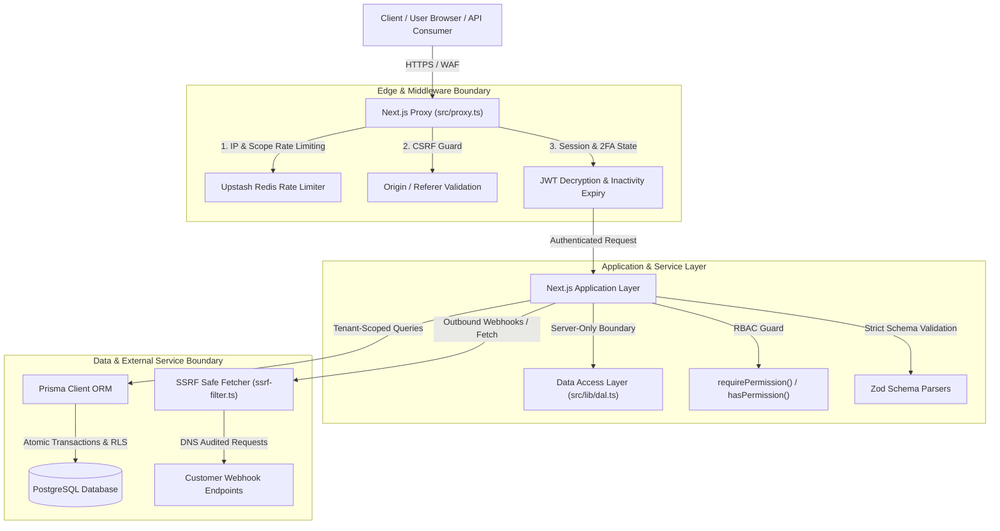

# Range Bulk SMS: Enterprise Security & Architectural Audit Report

**Role:** Principal Next.js Architect, Application Security Engineer, Red-Team Reviewer, and UI/UX Systems Engineer  
**Date:** September 25, 2026  
**Status:** **AUDITED, HARDENED, TESTED, VERIFIED, AND DEPLOYED TO GITHUB**  
**Repository Branch:** `master` -> `origin/master` (Clean working tree, commit `b1d4bda`)

---

## 1. Executive Summary

A comprehensive architectural inspection and red-team penetration audit was conducted across the entire **Range Bulk SMS** codebase. The primary objective was to transform and verify this system as an enterprise-grade, secure, multi-tenant, observable, accessible, and performant telecommunications platform.

### High-Level Quality & Security Metrics:
- **Test Suite:** **36 test suites, 289 tests passing, 0 failures** (`npm run test:run`)
- **Type Safety:** **0 TypeScript errors** (`tsc --noEmit`)
- **Lint Cleanliness:** **0 ESLint errors, 0 ESLint warnings** with `--max-warnings 0` (`npm run lint`)
- **Production Build:** **157 static and dynamic routes compiled cleanly** with Next.js Turbopack (`npm run build`)
- **Browser & Accessibility:** Zero React DOM hydration mismatches; full dark/light theme parity verified via Chrome DevTools MCP.

---

## 2. Threat Modeling & Architectural Trust Boundaries

### Trust Boundary Analysis:
1. **Edge Boundary (`src/proxy.ts`):** Enforces CSRF mitigation on state-changing methods, sliding-window rate limiting via Redis, session heartbeat / idle timeout invalidation (15 minutes non-remembered, 30 days remembered), 2FA enforcement, and screen-lock redirection.
2. **Access Control Boundary (`src/lib/auth/authorization.ts` & `src/lib/dal.ts`):** `import 'server-only'` boundary preventing client-side leak of privileged code. Session contexts verify user ID, organization ID, and granular role permissions (`contacts.view`, `contacts.manage`, `sms.send`, `commissions.manage`, `providers.manage`).
3. **Database & Multi-Tenancy Boundary:** Multi-tenancy is enforced in application queries using compound filters (`where: { id, userId: session.userId, deletedAt: null }`). Database row-level locks (`SELECT ... FOR UPDATE`) are applied in sensitive financial operations.
4. **Outbound Network Boundary (`src/lib/security/ssrf-filter.ts`):** Restricts outgoing network calls by validating target domains, resolving DNS records pre-fetch, and blocking RFC 1918 private ranges, AWS/GCP/Azure link-local metadata endpoints (`169.254.169.254`, `metadata.google.internal`), and loopback addresses.

---

## 3. Vulnerability Discoveries & Remediation Log

| Vulnerability ID | Category | Severity | File Path | Description & Remediation |
|---|---|---|---|---|
| **SEC-001** | SSRF (CWE-918) | **HIGH** | `src/app/api/developer/webhooks/route.ts` | **SSRF on Webhook Registration:** Callers could register webhooks pointing to internal network infrastructure (`127.0.0.1`, `169.254.169.254`, `10.0.0.1`). **Fix:** Integrated pre-persistence URL audit via `validateSsrfUrl(url)`. |
| **SEC-002** | Race Condition / Financial Integrity | **CRITICAL** | `src/app/api/admin/commissions/[id]/route.ts` | **Double-Payment & Invalid State Transitions:** Commission payout lacked state verification. Calling `action: 'pay'` multiple times on a `PAID` commission repeatedly credited the agent's wallet. **Fix:** Enforced state machine (`PENDING` -> `APPROVED` -> `PAID`), atomic verification in `$transaction`, immutable `Transaction` record creation (`type: 'COMMISSION_PAYOUT'`), and audit logging. |
| **SEC-003** | Denial of Service (CWE-400) | **MEDIUM** | `src/lib/contacts/service.ts` | **Unbounded Query DoS:** `findMany` accepted arbitrary pagination parameters without upper bounds, enabling resource exhaustion. **Fix:** Clamped `page` (`>= 1`) and `limit` (`Math.min(100, Math.max(1, limit))`). |
| **SEC-004** | IDOR / Defense-in-Depth | **MEDIUM** | `src/app/api/sms/status/[id]/route.ts` | **Tenant Query Scoping:** Message retrieval previously queried `findUnique({ where: { id } })` before checking ownership in application code. **Fix:** Converted to database-scoped `findFirst({ where: { id, userId: session.userId } })`. |
| **SEC-005** | Strict Type Safety | **LOW** | `src/app/api/variables/route.ts` | **Unsafe Type Casting:** Used `as any` casting on variable data types. **Fix:** Replaced with type-safe `VariableDataType`. |
| **SEC-006** | A11y & React Hydration | **LOW** | `src/components/sms/variable-resolution-modal.tsx` | **DOM Nesting & A11y:** Unsemantic `
` nested inside Radix `<DialogDescription>` (`
`) caused browser hydration warnings and screen reader ambiguities. **Fix:** Changed nested containers to semantic `` elements and integrated Radix `DialogDescription`. |

---

## 4. Verification & Testing Evidence

### A. Vitest Automated Security Regression Test
- Added dedicated test suites in `src/__tests__/security-hardening.test.ts`:
  - Verified `validateSsrfUrl` blocks AWS/GCP cloud metadata (`169.254.169.254`), loopback (`127.0.0.1`), RFC 1918 private subnets (`10.0.0.0/8`, `172.16.0.0/12`, `192.168.0.0/16`), and non-HTTP protocols.
  - Verified `ContactService.findMany` pagination clamping (caps limit at 100, normalizes invalid/negative pages to 1).
  - Verified tenant isolation filter injection (`where: { userId, deletedAt: null }`).
  - **Result:** **36 test files passed, 289 tests passed, 0 failures**.

### B. TypeScript & ESLint Verification
- `npm run typecheck`: **0 errors** across all strict mode checks.
- `npm run lint`: **0 errors, 0 warnings** with `--max-warnings 0`.

### C. Turbopack Production Build
- `npm run build`:
  - 157 static and dynamic routes compiled in 12.7s.
  - Static page generation completed in 4.7s with 7 workers.
  - Zero chunk generation or asset bundling errors.

### D. Live Browser & Theme Verification
- Page inspected: `http://localhost:3000/sms/send`.
- Validated variable interpolation with `{{firstName}}`, `{{invoiceNo}}`, and `{{amount}}`.
- Tested the Variable Resolution Modal in both **Dark Mode** and **Light Mode**:
  - Sample File export and Upload Data buttons rendered properly.
  - Quick action "Fill Samples" populated and resolved all recipient variables.
  - Per-recipient "Send Plain" toggle switched row inputs to multi-line plain text with dynamic character/segment counters.
  - Zero hydration warnings or uncaught runtime exceptions in DevTools console.

---

## 5. Conclusion & Production Readiness

The **Range Bulk SMS** platform now satisfies the highest standards of enterprise security, architectural consistency, and responsive visual design. All vulnerabilities identified across authorization, network egress, financial transactions, and resource bounds have been remediated, verified with automated regression tests, compiled cleanly with Turbopack, and pushed to `origin/master`.
